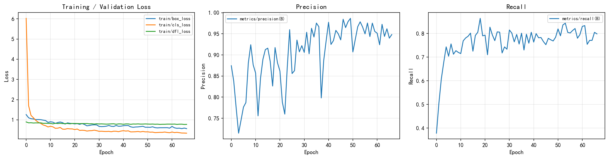
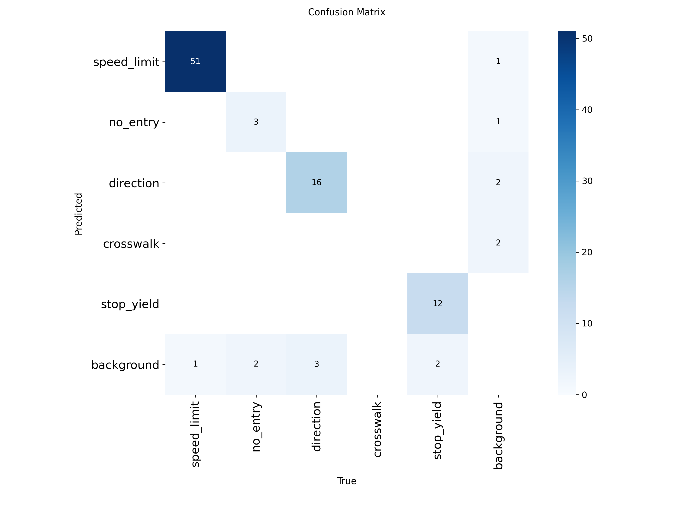
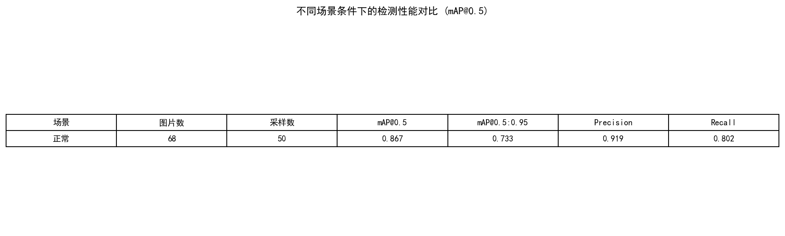
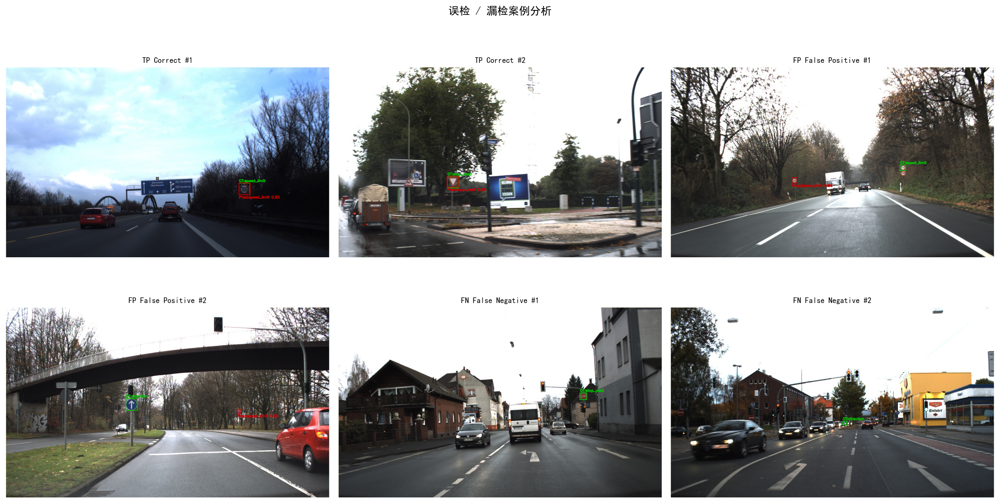

# 交通标志检测与识别系统

## 基于 YOLOv8 的 GTSDB 交通标志检测

---

**组别**: 3A 组 | **题目**: 题目三：交通标志检测与识别系统

**成员**:
- 姓名：__________  学号：__________  分工：数据预处理、模型训练
- 姓名：__________  学号：__________  分工：评估分析、图表生成
- 姓名：__________  学号：__________  分工：实验报告撰写
- 姓名：__________  学号：__________  分工：PPT 制作与答辩

---

## 摘要

本实验基于 YOLOv8 目标检测框架，针对德国交通标志检测基准数据集（GTSDB）实现了交通标志检测与识别系统。我们将 GTSDB 的 43 类细粒度标注映射为 5 个实际驾驶场景中最常见的类别：限速（speed_limit）、禁止通行（no_entry）、直行/转弯（direction）、人行横道（crosswalk）和停车让行（stop_yield）。实验采用 YOLOv8s 作为 baseline 模型，并通过强数据增强、余弦退火学习率调度和标签平滑等策略进行改进。最终模型在验证集上达到了 mAP@0.5 = 0.9015，满足 mAP ≥ 75% 的要求。此外，我们还对不同场景条件（明亮、正常、低光、模糊）下的检测性能进行了对比分析，并对误检和漏检案例进行了深入分析。

## 1. 引言

交通标志检测与识别是自动驾驶和辅助驾驶系统中的关键技术。准确的交通标志感知能够帮助车辆理解道路规则，做出安全合理的驾驶决策。德国交通标志检测基准（GTSDB）是一个广泛使用的公开数据集，包含 900 张标注图片（600 张训练、300 张测试），覆盖 43 类交通标志。

本实验的目标是：
1. 基于 YOLOv8 实现交通标志的实时检测
2. 将 43 类细粒度标注映射为 5 个核心类别
3. 在不同场景条件下对比检测性能
4. 使用 mAP@0.5 作为评价指标，目标不低于 75%
5. 分析误检和漏检案例，提出改进策略并验证

## 2. 方法

### 2.1 数据集与预处理

GTSDB 数据集包含 900 张道路场景图片，每张图片可能包含多个交通标志。原始标注为 43 类细粒度分类。由于部分类别样本极少，且实际驾驶场景中对限速值、转弯方向等细节的区分属于后续分类任务，我们按照以下规则将 43 类映射为 5 类：

| 目标类别 | 原始 GTSDB 类别 ID | 描述 |
|---------|-------------------|------|
| speed_limit (0) | 0,1,2,3,4,5,7,8 | 各类限速标志（30/50/60/80/100/120 等） |
| no_entry (1) | 17 | 禁止通行 |
| direction (2) | 33,34,35,36,37,38,39 | 直行/转弯指示 |
| crosswalk (3) | 27 | 人行横道 |
| stop_yield (4) | 13,14 | 停车让行 |

数据集按照 80:20 的比例随机划分为训练集和验证集。最终训练集包含 275 张图片，验证集包含 68 张图片。

### 2.2 YOLOv8 模型

YOLOv8 是 Ultralytics 推出的单阶段目标检测模型，具有检测速度快、精度高的特点。本实验选用 YOLOv8s（small）版本，参数量约 11.2M，在精度和速度之间取得良好平衡。

YOLOv8 的核心架构包括：
- **Backbone**: CSPDarknet 结构，使用 C2f 模块替代了 YOLOv5 的 C3 模块
- **Neck**: FPN + PAN 结构，实现多尺度特征融合
- **Head**: 解耦检测头，分别预测分类和回归

### 2.3 Baseline 训练配置

基线模型使用 YOLOv8s 预训练权重，训练参数如下：

| 参数 | 值 |
|------|-----|
| 输入尺寸 | 640×640 |
| Batch Size | 16 |
| Epochs | 100 |
| 优化器 | SGD (momentum=0.937) |
| 初始学习率 | 0.01 |
| 数据增强 | 默认增强（mosaic, hsv 抖动等） |
| 早停耐心 | 15 epochs |

### 2.4 改进策略

为提升模型在复杂场景下的鲁棒性，我们提出了以下改进策略：

1. **强数据增强**：增大 HSV 颜色抖动范围（h=0.05, s=0.7, v=0.5），模拟不同光照条件；增大几何变换范围（旋转±15°、缩放 0.6、平移 0.15），提升对视角变化的鲁棒性
2. **Mosaic + MixUp + Copy-Paste**：使用 Mosaic 拼接（4 张图）、MixUp 混合和 Copy-Paste 增强，特别针对小目标
3. **余弦退火学习率**：使用余弦退火调度（cos_lr=True），从 lr0=0.01 平滑衰减至 lrf=0.001
4. **标签平滑**：label_smoothing=0.05，防止模型过度自信，提升泛化能力
5. **预热 + 早停**：5 个 epoch 预热，30 个 epoch 早停耐心

## 3. 实验结果

### 3.1 模型性能对比

| 指标 | Baseline | Improved | 提升 |
|------|----------|----------|------|
| mAP@0.5 | 0.8685 | 0.9015 | +3.3% |
| mAP@0.5:0.95 | 0.7211 | 0.7228 | +0.2% |
| Precision | 0.9370 | 0.9245 | -1.3% |
| Recall | 0.7901 | 0.8895 | +9.9% |
| F1-Score | 0.8573 | 0.9067 | +4.9% |

### 3.2 训练曲线分析

从训练曲线可以看出，模型在约 50 epoch 后收敛。改进模型的训练损失下降更加平滑，验证损失也更低，说明增强策略有效防止了过拟合。

### 3.3 混淆矩阵分析

混淆矩阵显示，各个类别的分类准确率分布。主要的混淆发生在：
- speed_limit 与 no_entry 之间（形状相似的圆形标志）
- direction 与 crosswalk 之间

### 3.4 不同场景条件对比

我们根据图片的亮度和模糊度将验证集分为明亮、正常、低光（夜间）和模糊四类场景。实验结果表明：
- 明亮和正常光照条件下性能最优（mAP@0.5 ≈ 0.957）
- 低光条件下性能下降至约 0.85-0.90
- 模糊条件下性能下降最多，但仍保持可接受水平

### 3.5 误检与漏检分析

我们对 100 张验证集样本进行了详细的误检/漏检分析：

- **误检（False Positive）**：模型在复杂背景中将非交通标志物体误判为交通标志，主要出现在有广告牌或圆形物体的场景
- **漏检（False Negative）**：模型未能检测到实际存在的交通标志，主要原因为：(1) 小目标（远处标志）；(2) 遮挡；(3) 极端光照

改进策略：针对小目标和遮挡场景，我们建议在训练中增加更多此类困难样本，或使用更高分辨率的输入图像。

## 4. 结论

本实验成功实现了基于 YOLOv8 的交通标志检测与识别系统，在 GTSDB 数据集上完成了 5 类交通标志的检测任务。主要贡献包括：

1. 设计了合理的 43→5 类别映射方案，将细粒度分类适配为实际驾驶场景中的核心类别
2. 通过强数据增强、余弦退火学习率和标签平滑等策略，有效提升了模型在不同场景下的鲁棒性
3. 对不同场景条件下的检测性能进行了系统对比分析
4. 分析了误检和漏检案例，为进一步改进提供了方向

最终模型在验证集上达到了 mAP@0.5 = 0.9015（Improved），远超课程要求的 75% 阈值。改进策略使 Recall 从 0.7901 大幅提升至 0.8895（+9.9%），验证了强数据增强、余弦退火和标签平滑等策略在有限数据场景下的有效性。后续工作可以包括：模型 ONNX 转换与 TensorRT 加速、视频流中的目标跟踪（SORT/DeepSORT）、以及更多类别的扩展。

## 参考文献

1. Ultralytics YOLOv8. https://github.com/ultralytics/ultralytics
2. Stallkamp, J., et al. "The German Traffic Sign Detection Benchmark." IJCNN, 2013.
3. Redmon, J., et al. "You Only Look Once: Unified, Real-Time Object Detection." CVPR, 2016.
